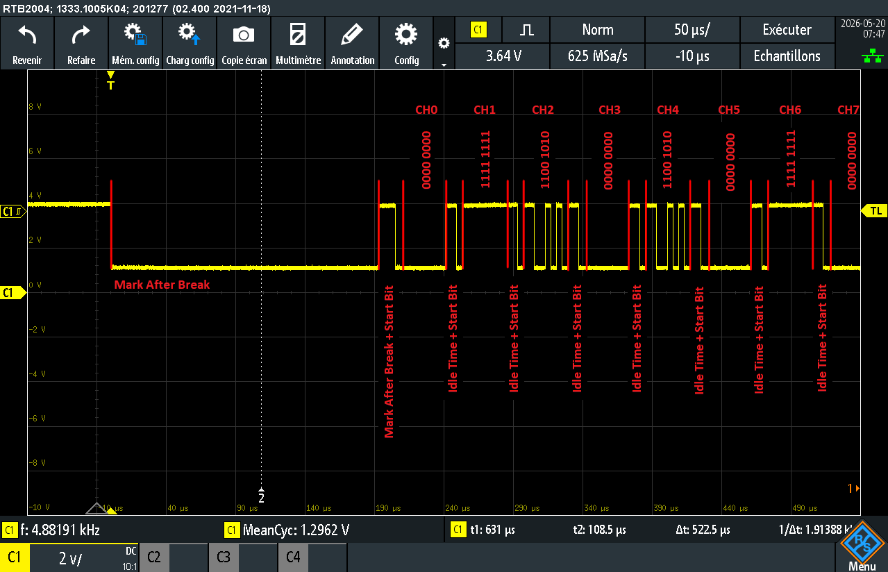
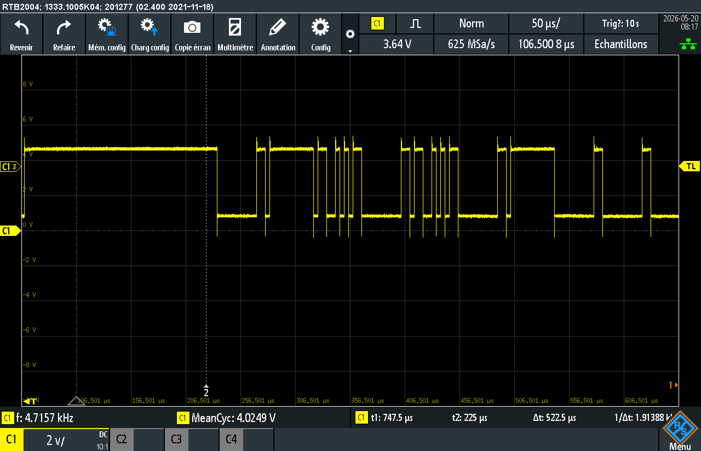
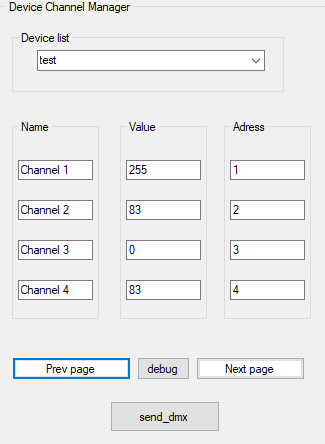
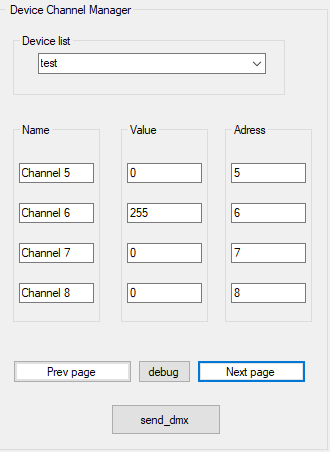

# Projet de Contrôle DMX

## Présentation

Ce projet permet de contrôler des équipements d’éclairage via le protocole **DMX512** en utilisant une application C#.

---

## Protocole DMX512

### Qu’est-ce que le DMX ?

Le **DMX512 (Digital Multiplex)** est un protocole standard utilisé en éclairage scénique.

- Communication **unidirectionnelle**
- Jusqu’à **512 canaux par univers**
- Chaque canal possède une valeur entre **0 et 255**
- Utilise la couche physique **RS-485**

---

### Structure d’une trame DMX

Une trame DMX est envoyée en continu et se compose de :

1. **Break**
   - Signal bas (> 88 µs)
   - Indique le début d’une nouvelle trame

2. **Mark After Break (MAB)**
   - Signal haut court (~8 µs)

3. **Start Code**
   - Généralement `0x00` (données standards)

4. **Données (slots)**
   - Jusqu’à **512 canaux**
   - Chaque canal = 1 octet (0–255)

#### Exemple :
| Canal | Fonction     |
|------|-------------|
| 1    | Intensité    |
| 2    | Rouge        |
| 3    | Vert         |
| 4    | Bleu         |

## Interfaces matérielles

Ce projet supporte les interfaces suivantes :

### Enttec Open DMX USB
- Interface simple
- Pas de buffer interne
- Timing géré par le logiciel (windows)
- Moins stable

### Enttec DMX USB Pro
- Interface avancée
- Buffer interne (gestion hardware)
- Plus stable et fiable
- Protocole série structuré

> Important : ces deux interfaces nécessitent une gestion différente dans le code.
> une aura une gestion via un driver windows et l'autre via une librairie visual....

---

## Environnement de développement

- **Langage** : C++
- **Système de build** : Visual Studio 2022 (le rose tu sais)
- **OS cible** : Windows 10

---

## Librairies utilisées

- Communication USB (Open DMX) :

## Validation du code

### Mesure DMX
#### Schema de mesure
#### Premiere mesure
| Mesure DMX USB PRO | mesure OPEN DMX   |
|------|-------------|
|  | |

| premiere page | deuxieme page     |
|------|-------------|
|    |     |
#### Remarque
comme on peut le voir, les trames presentes sur l'oscilloscope sont bien correct
|--|DMX USB PRO|--|
| valeur attendu (binaire) | valeur que l'on obtient (binaire) | channel |
|------|-------------|--|
|0b0000 0000|0b0000 0000|0|
| 0b1111 1111  | 0b1111 1111 |1|
| 0b0101 0011  | 0b0101 0011 |2|
| 0b0000 0000  | 0b0000 0000 |3|
| 0b0101 0011  | 0b0101 0011 |4|
| 0b0000 0000  | 0b0000 0000 |5|
| 0b1111 1111  | 0b1111 1111 |6|
| 0b0000 0000  | 0b0000 0000 |7|
| 0b0000 0000  | 0b0000 0000 |8|

|--|OPEN DMX|--|
| valeur attendu (binaire) | valeur que l'on obtient (binaire) | channel |
|------|-------------|--|
|0b0000 0000|0b0000 0000|0|
| 0b1111 1111  | 0b1111 1111 |1|
| 0b0101 0011  | 0b0101 0011 |2|
| 0b0000 0000  | 0b0000 0000 |3|
| 0b0101 0011  | 0b0101 0011 |4|
| 0b0000 0000  | 0b0000 0000 |5|
| 0b1111 1111  | 0b1111 1111 |6|
| 0b0000 0000  | 0b0000 0000 |7|
| 0b0000 0000  | 0b0000 0000 |8|

Comme on peut le voir dans les deux tableau ci-dessus, entre ce qui est attendu et ce qui est obtenu dans les mesures il n'y a pas d'erreur dans l'algorithme.
On peut neanmoins remarqué que la mesure du module OPEN DMX n'est pas aussi propre que celle du DMX USB PRO car les deux modules generent le dmx differement.
Dans un cas, nous avons le OPEN DMX qui ne sert que d'interface entre windows et les appareils DMX ce qui fait que windows doit faire toutes la generation des signaux. Etant donné que windows n'a pas été concu pour ca les timings du DMX ne sont pas respecté ce qui rend le signal impropre comparé au norme.
Alors que dans l'autre, les données sont envoyer depuis windows vers un micro controleur dedié à la gestion d'une trame DMX en respectant tout les timings de la norme DMX.

